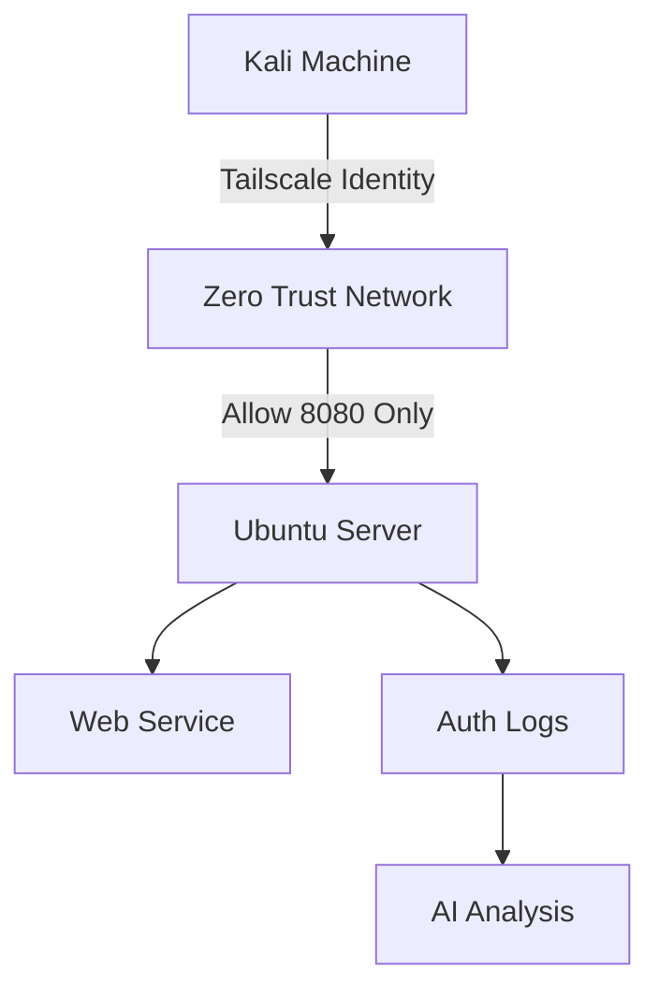

# Zero Trust & Identity Lab

A hands-on cybersecurity lab demonstrating how to transition from traditional perimeter security to a **Zero Trust Architecture (ZTA)**.

This lab follows the principles defined in **NIST SP 800-207** and uses identity-based networking to secure access between systems.

---

## Lab Scenario

You are a **Junior Security Analyst** tasked with securing a Linux server using Zero Trust principles.

Instead of relying on IP-based trust, access will be granted based on **identity and policy enforcement**.

---

## Learning Objectives

By completing this lab, you will learn how to:

• Implement identity-based networking using Tailscale  
• Restrict network access using micro-segmentation  
• Enforce the Principle of Least Privilege with Linux sudo policies  
• Use Generative AI tools to analyze authentication logs  

---

## Technology Stack

| Component | Tool |
|----------|------|
| Zero Trust Networking | Tailscale |
| Identity Provider | GitHub SSO |
| Server Environment | Ubuntu Linux |
| Analyst Workstation | Kali Linux |
| Access Control | Tailscale ACL |
| Privilege Management | Linux sudoers |

---

## Lab Milestones

### 1️⃣ Identity-Centric Connectivity
Connect systems using identity-based networking instead of IP trust.

### 2️⃣ Micro-Segmentation
Allow access only to a specific service (port 8080).

### 3️⃣ Principle of Least Privilege
Configure a limited **Junior Admin** role using Linux RBAC.

### 4️⃣ Generative AI Security Analysis
Use AI tools to analyze authentication logs and detect security violations.

---

## Repository Structure
zero-trust-identity-lab
│
├ README.md
├ docs
│ └ lab-guide.md
├ configs
│ └ tailscale-acl.json
├ diagrams
│ └ architecture.md
└ logs
└ sample-auth.log

---

## Start the Lab

See the step-by-step guide here:

`docs/lab-guide.md`
## Architecture Diagram

