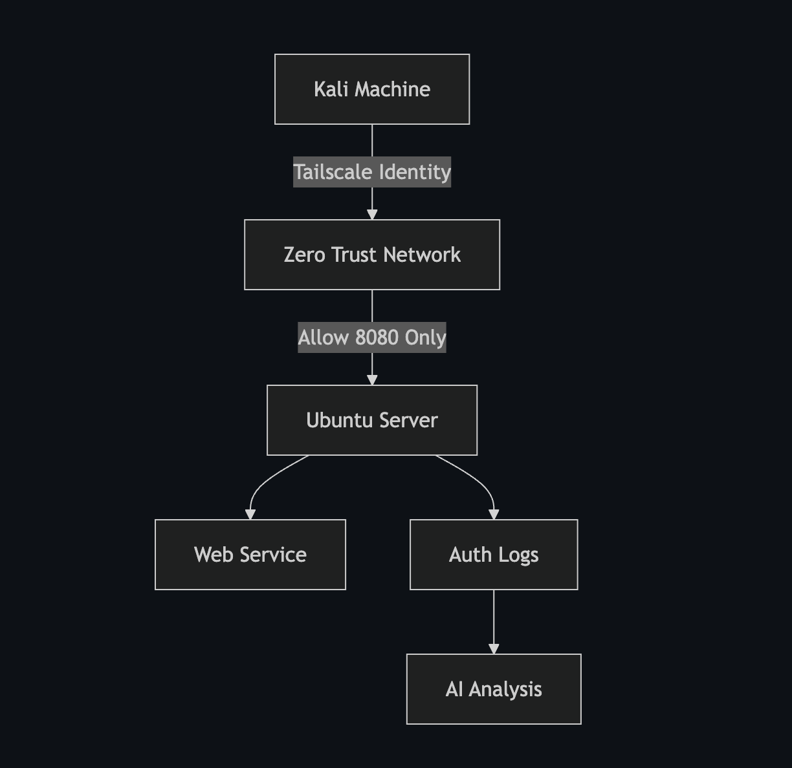

# 🔐 Zero Trust Identity Lab

A hands-on lab demonstrating the transition from traditional perimeter security to a modern **Zero Trust Architecture (ZTA)** based on NIST SP 800-207.

---

## 🚀 Live Lab

👉 [Start the Lab Guide](lab-guide.html)

---

## 🧠 What This Lab Covers

- 🔑 Identity-Based Networking using Tailscale  
- 🔒 Micro-Segmentation using ACL Policies  
- 👤 Principle of Least Privilege (Linux RBAC)  
- 📊 Security Log Analysis using AI  

---

## 🏗 Architecture Overview

---

## 🎯 Key Security Outcomes

✔ Eliminated implicit trust  
✔ Restricted lateral movement  
✔ Enforced least privilege  
✔ Logged and analysed security violations  

---

## 🧪 Target Audience

This lab is designed for:

- Beginner Security Analysts  
- Students learning Zero Trust  
- Anyone exploring identity-based security  

---

## 💡 Why This Matters

Traditional networks trust users inside the perimeter.

Zero Trust assumes:

> **"Never Trust, Always Verify"**

Every request is authenticated, authorised, and logged.

---
